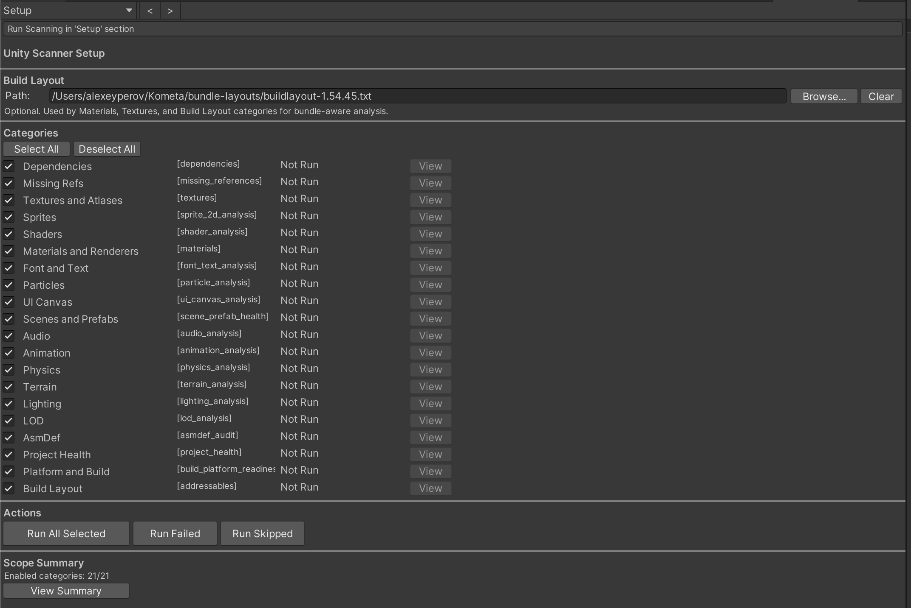
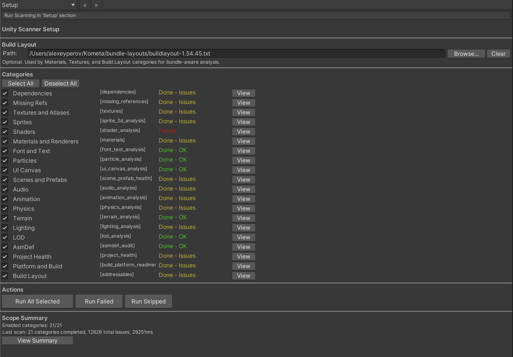
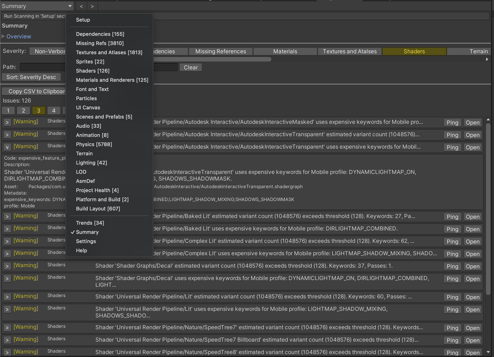
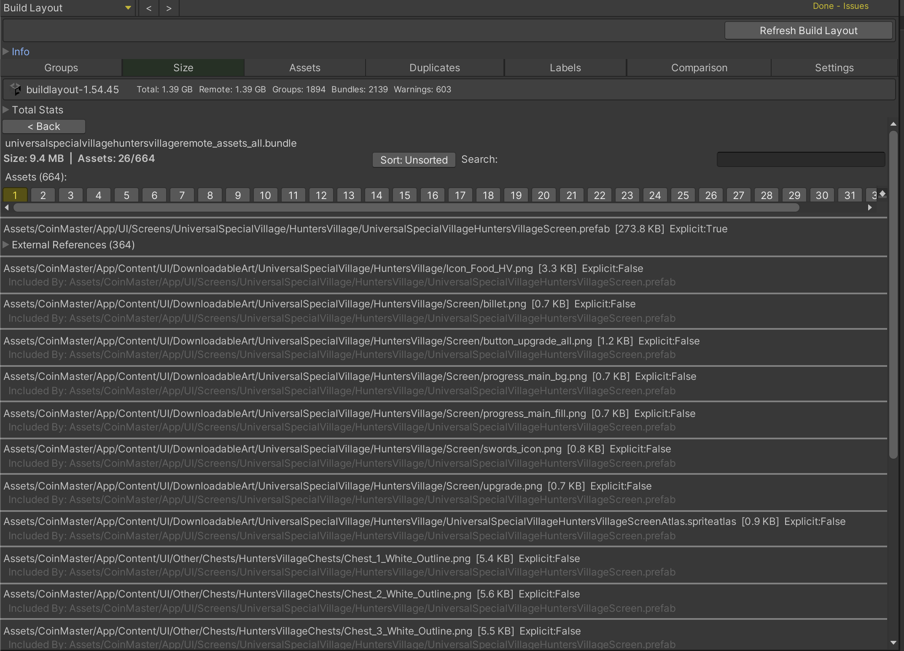
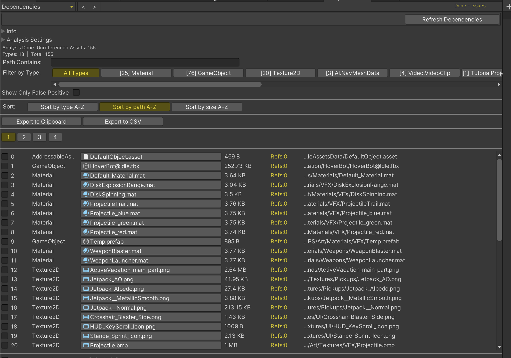
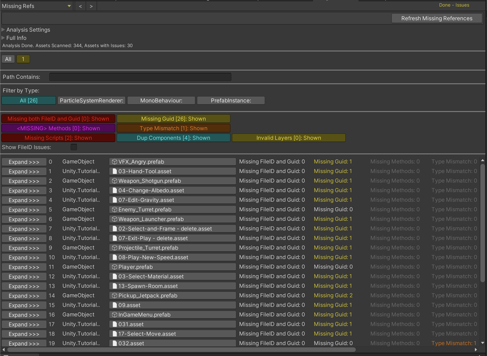
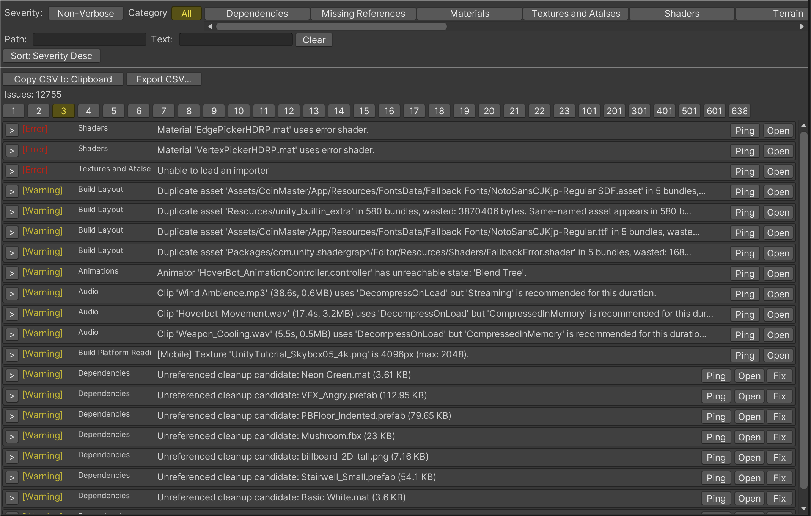
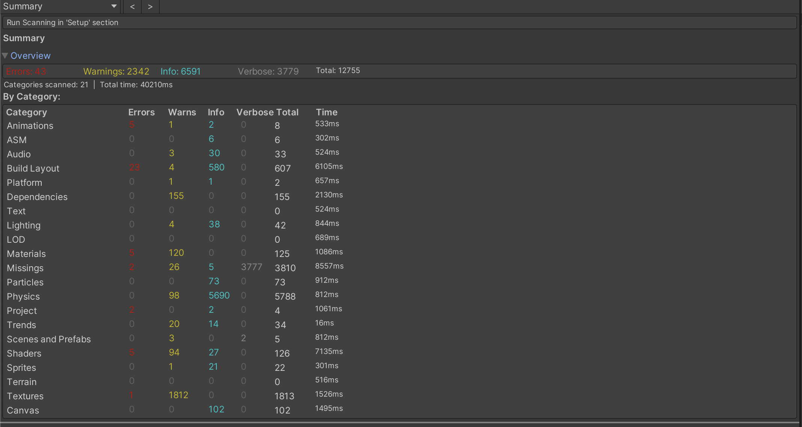

# UnityScanner 

##
A unified Unity Editor tool for project health analysis across 14 categories.
Combines dependency scanning, addressables build layout analysis, missing reference detection, material/texture/shader auditing, and platform readiness checks — all in one modular window with batch API support.

**Menu:** `Tools > Unity Scanner`

# How it works

UnityScanner is built around independent analysis categories. Each category scans a specific aspect of your project:

- **Dependencies** — finds unreferenced/unused assets by building a full reverse-dependency map
- **Missing References** — scans scenes, prefabs, and ScriptableObjects for broken GUID/FileID references, missing scripts, empty references, and type mismatches
- **Materials** — detects null/builtin materials, missing shaders, render queue overrides, duplicate materials, unused materials, variant chain issues, and SRP batcher compatibility
- **Textures** — checks SpriteAtlases and Texture2D assets for atlas duplicates, compression issues, oversized textures, and format mismatches
- **Shader Analysis** — finds error shaders, variant explosion, expensive keywords, and render pipeline mismatches
- **Terrain Analysis** — checks terrain colliders, layers, control map memory, and density overages
- **Font & Text** — detects TMP atlas growth risks, oversized atlases, and deep fallback chains
- **Audio** — finds load-type mismatches, oversized clips, and duplicate audio files
- **Animation** — detects unreachable states, missing clips, state machine complexity, and duplicate clips
- **Scene/Prefab Health** — checks deep nesting, override explosion, broken references, and inactive object anti-patterns
- **Build/Platform Readiness** — validates import policies, platform compatibility, stripping risks, and startup budgets
- **Project Health** — detects empty folders, orphaned .meta files, broken assets, empty scenes, excessive folder nesting, and oversized directories
- **Build Layout (Addressables)** — parses Build Layout files for circular dependencies, remote dependency issues, and duplicate assets
- **Regression/Trend** — compares scan results against a saved baseline to detect regressions and improvements

All categories share a unified issue model with severity levels: `Verbose`, `Info`, `Warning`, `Error`.

# Ways of usage

## To analyze your project..
..open `Tools > Unity Scanner` to launch the main window.

Select categories in the Setup tab and click "Run All Selected", or navigate to any category tab and click the Scan/Refresh button to run it individually.

Each category tab shows filters, sort controls, expandable detail rows, and export buttons.

## To find references to selected assets..
..select assets in the Project browser and use the context menu option `[US] Find References In Project`.

This opens a dedicated window listing all assets that reference your selection, with search, sort, and filter controls.

## To run from CI/batch mode..
..use the programmatic API:

```csharp
using UnityScanner.Batch;

var result = UnityScannerBatch.RunAll(new BatchOptions {
    Categories = new[] { "dependencies", "missing_references", "materials" },
    PlatformProfile = "mobile",
    FailOnSeverity = "warn"
});
```

Or run individual categories:
```csharp
UnityScannerBatch.RunDependencies();
UnityScannerBatch.RunMissingReferences();
UnityScannerBatch.RunShaderAnalysis(new BatchOptions { PlatformProfile = "mobile" });
UnityScannerBatch.RunBuildPlatformReadiness(new BatchOptions { FailOnSeverity = "error" });
```

## Analysis Examples


| Analysis Start                             | Analysis Done                      |
|--------------------------------------------|-------------------------------------------|
|  |  |


| All Types of Analysis                       | BuildLayout Analysis                       |
|---------------------------------------------|--------------------------------------------|
|  |  |

| Dependencies Analysis               | Missing Refs Analysis                   |
|-------------------------------------|-----------------------------------------|
|  |  |


| Summary Table                               | Summary List                                 |
|---------------------------------------------|----------------------------------------------|
|  |  |

## Settings

Each category has its own settings accessible from the "Analysis Settings" foldout in the category tab. Global settings (platform profile, cache) are in the Settings tab.

Platform profiles adjust thresholds per target:

| Setting | Mobile | Console | Desktop |
|---|---:|---:|---:|
| Max Texture Size | 2048 | 4096 | 8192 |
| Shader Variant Threshold | 128 | 512 | 1024 |
| Scene Object Count | 2000 | 10000 | 20000 |
| Startup Scene Budget (KB) | 20480 | 102400 | 204800 |

Select a profile in the Settings tab or pass `-usPlatformProfile mobile|console|desktop` to the batch API.

# Batch API

### Common Arguments

| Argument | Description |
|---|---|
| `-usCategories` | Comma-separated category IDs (default: all enabled) |
| `-usOutput` | Output file path |
| `-usOutputFormat` | `json`, `csv`, or `log` (default: `json`) |
| `-usBuildLayout` | Path to BuildLayout.txt (for Addressables) |
| `-usFailOnSeverity` | `error`, `warn`, `info`, `verbose`, or `never` |
| `-usPlatformProfile` | `mobile`, `console`, or `desktop` |
| `-usDryRun` | Enable dry-run mode for destructive operations |

### Category IDs

`dependencies`, `missing_references`, `materials`, `textures`, `shader_analysis`, `terrain_analysis`, `font_text_analysis`, `audio_analysis`, `animation_analysis`, `scene_prefab_health`, `build_platform_readiness`, `project_health`, `addressables`, `regression_trend`

### Exit Codes

| Code | Meaning |
|---:|---|
| 0 | No issues crossing failure threshold |
| 1 | Issues at or above fail severity |
| 2 | Invalid arguments |
| 3 | Required input missing |
| 4 | Unexpected runtime failure |

### CI Gate Examples

**Mobile build readiness gate:**
```csharp
var result = UnityScannerBatch.RunBuildPlatformReadiness(new BatchOptions {
    PlatformProfile = "mobile",
    FailOnSeverity = "error"
});
```

**Regression gate — fail if errors increased vs baseline:**
```csharp
var result = UnityScannerBatch.RunRegressionTrend(new BatchOptions {
    BaselinePath = "CI/baseline.json",
    RegressionThreshold = 0,
    FailOnSeverity = "warn"
});
```

**Addressables bundle gate:**
```csharp
var result = UnityScannerBatch.RunAddressables(new BatchOptions {
    BuildLayoutPath = "BuildReports/BuildLayout.txt",
    FailOnSeverity = "warn"
});
```
# Architecture

```
Assets/Editor/UnityScanner/
  Core/           — Category registry, issue model, results, settings
  Categories/     — 13 category modules (scanner, mapper, settings, tab drawer)
  UI/             — Main window, controls
  Batch/          — Batch API entry points
  Windows/        — Standalone windows (Find References)
  ContextMenus/   — [US] menu entries
```

Each category follows the same structure:
- `*Category.cs` — `IUnityScannerCategory` implementation
- `*Scanner.cs` — Core scanning logic
- `*Settings.cs` — Category-specific settings/thresholds
- `*IssueMapper.cs` — Maps findings to `UnityScannerIssue`
- `*TabDrawer.cs` — `IUnityScannerTabDrawer` UI implementation
- `*FixProvider.cs` — Optional fix actions

---

## Installation

1. Using Unity's Package Manager via link https://github.com/AlexeyPerov/Unity-Scanner.git
2. You can also just copy and paste all files inside Editor folder

## Contributions

Feel free to report bugs, request new features or to contribute to this project!

## Other tools

##### Dependencies Hunter

- To find unreferenced assets in Unity project see [Dependencies-Hunter](https://github.com/AlexeyPerov/Unity-Dependencies-Hunter).

##### Addressables Inspector

- To analyze addressables layout [Addressables-Inspector](https://github.com/AlexeyPerov/Unity-Addressables-Inspector).

##### Missing References Hunter

- To find missing or empty references in your assets see [Missing-References-Hunter](https://github.com/AlexeyPerov/Unity-MissingReferences-Hunter).

##### Materials Hunter

- To analyze your materials and renderers see [Materials-Hunter](https://github.com/AlexeyPerov/Unity-Materials-Hunter).

##### Textures Hunter

- To analyze your textures and atlases see [Textures-Hunter](https://github.com/AlexeyPerov/Unity-Textures-Hunter).

##### Asset Inspector

- To analyze asset dependencies [Asset-Inspector](https://github.com/AlexeyPerov/Unity-Asset-Inspector).

##### Editor Coroutines

- Unity Editor Coroutines alternative version [Lite-Editor-Coroutines](https://github.com/AlexeyPerov/Unity-Lite-Editor-Coroutines).
- Simplified and compact version [Pocket-Editor-Coroutines](https://github.com/AlexeyPerov/Unity-Pocket-Editor-Coroutines).

